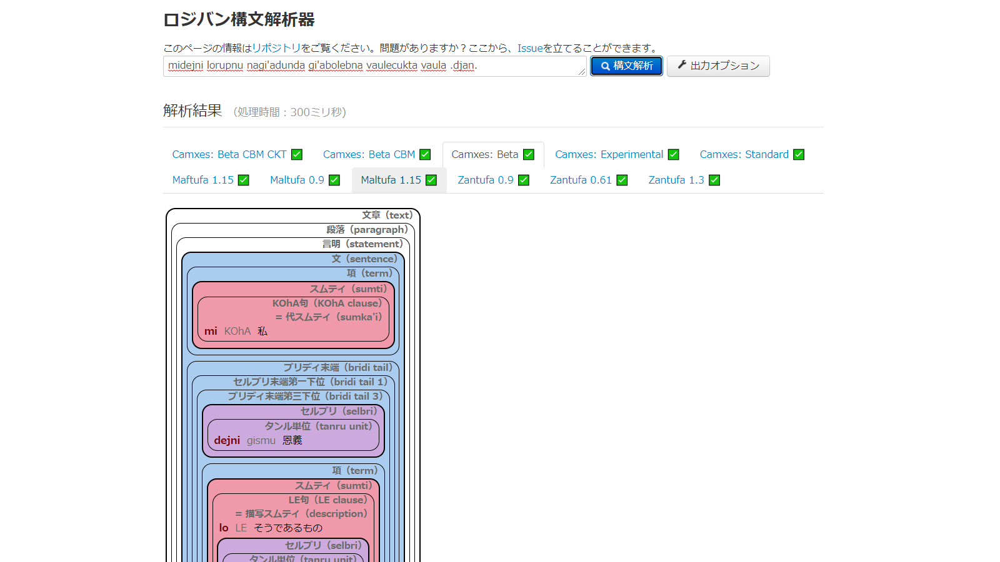

# genturcta

genturcta は様々なロジバンパーサの解析結果を可視化して、見比べることが簡単にできます。

## 使用したパーサ

### camxes.js

作者：
[Masato Hagiwara](https://github.com/mhagiwara)

### camxes-beta.js

作者：
[Ilmen](https://github.com/Ilmen-vodhr)

### maftufa-1.15.js

作者：
[la .guskant.](https://github.com/guskant)

### maltufa-0.9.js

作者：
[la .guskant.](https://github.com/guskant)

### maltufa-1.15.js

作者：
[la .guskant.](https://github.com/guskant)

### zantufa-0.9.js

作者：
[la .guskant.](https://github.com/guskant)

### zantufa-0.61.js

作者：
[la .guskant.](https://github.com/guskant)

### zantufa-1.3.js

作者：
[la .guskant.](https://github.com/guskant)

## 使用したプログラム

### [ilmentufa](https://github.com/lojban/ilmentufa)

作者：
[The Lojban Coder's Group on Github](https://github.com/lojban)

貢献者：
[Ilmen](https://github.com/Ilmen-vodhr)、
[la .guskant.](https://github.com/guskant)、
[durka](https://github.com/durka)、
[gleki](https://github.com/lagleki)、
[maltesl](https://github.com/maltesl)、
[Vito Van](https://github.com/VitoVan)、
[Lynn](https://github.com/lynn)

### [ilmentufa/glosser](https://lojban.github.io/ilmentufa/glosser/glosser.htm)

フロントデザイン： la .uilym

### [gerna_cipra](https://github.com/guskant/gerna_cipra)

作者：
[la .guskant.](https://github.com/guskant)
